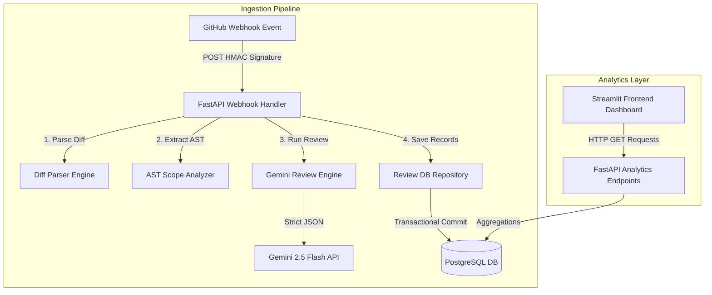

# 🔍 Code Review Intelligence System (CRIS)

[](https://www.python.org/)
[](https://fastapi.tiangolo.com/)
[](https://streamlit.io/)
[](LICENSE)

**CRIS (Code Review Intelligence System)** is an AI-powered static, semantic, and contextual code review assistant. It parses incoming unified git diffs, extracts precise AST scope context from modified files, combines them to construct rich prompts, queries Gemini 2.5 Flash with Pydantic-enforced response schemas, and persists analysis metrics transactionally in PostgreSQL. The system presents visual findings and repo health trends on a sleek Streamlit analytics dashboard.

---

## 🛠️ System Architecture

CRIS enforces a decoupled architecture. The Streamlit frontend interacts exclusively through backend REST endpoints to query metrics, leaving database access strictly inside the FastAPI service layer.



For detailed diagrams (Sequence Diagram, database Entity Relationship Diagram) and deployment patterns, see [architecture.md](docs/architecture.md).

---

## ✨ Core Features

1. **GitHub Ingestion Hook**: Secure webhook handler (`POST /api/v1/webhook/github`) verifying authenticity via HMAC-SHA256 signatures (`X-Hub-Signature-256`).
2. **AST Scope Matching**: Leverages Python's `ast` module to analyze structural code boundaries. Identifies modified functions/classes and traces enclosing loops, conditional statements, or try-except scopes.
3. **Pydantic-Enforced JSON Output**: Connects to the modern `google-genai` SDK using a strict Pydantic response schema to return structured findings without format errors.
4. **PostgreSQL Persistence**: Transacts reviews using SQLAlchemy. Schema maps repositories, pull requests, files reviewed, and specific issues with automatic cascading deletes.
5. **Interactive Dashboard**: Streamlit interface containing metric KPI cards, repository & PR review selectors, issue type pie charts, severity charts, and historical timeline trends.

---

## ⚙️ Environment Variables Documentation

Create a `.env` file in the root workspace folder matching the keys in [.env.example](.env.example):

| Variable | Required | Default | Description |
| :--- | :---: | :--- | :--- |
| `GEMINI_API_KEY` | **Yes** | — | API key for Gemini 2.5 Flash (from Google AI Studio). |
| `GITHUB_TOKEN` | **Yes** | — | Personal Access Token (PAT) to fetch PR diffs & files content. |
| `GITHUB_WEBHOOK_SECRET` | **Yes** | — | Shared secret token configured in GitHub webhooks to verify signatures. |
| `DB_USER` | No | `postgres` | Username for PostgreSQL database. |
| `DB_PASSWORD` | No | `postgres` | Password for PostgreSQL database. |
| `DB_HOST` | No | `127.0.0.1`| Hostname for the PostgreSQL database server. |
| `DB_PORT` | No | `5432` | Port number of the PostgreSQL service. |
| `DB_NAME` | No | `cris_db` | Name of the database schema to persist data. |

---

## 🚀 Setup & Installation

### Prerequisites
- Python 3.11 installed.
- PostgreSQL database server running locally.

### 1. Repository Setup & Virtual Environment
```bash
# Clone the repository
git clone https://github.com/milimathew2005/CRIS-Code-Review-Intelligence-System.git
cd CRIS-Code-Review-Intelligence-System

# Create virtual environment
python -m venv .venv
source .venv/bin/activate  # Windows: .venv\Scripts\Activate.ps1
pip install -r requirements.txt
```

### 2. Database Migration (Local Development Setup)
To run schema tables setup locally using SQLite or run automatic table initialization:
```bash
# Verify test database passes and initializes tables
pytest backend/tests/
```

For detailed production database migrations via Alembic, refer to [architecture.md](docs/architecture.md#4-deployment-guide).

### 3. Execution

#### Start backend service (FastAPI)
```bash
python -m uvicorn backend.app.main:app --port 8000 --reload
```
- Swagger API Docs: [http://localhost:8000/docs](http://localhost:8000/docs)

#### Start frontend dashboard (Streamlit)
```bash
streamlit run frontend/app.py --server.port 8501
```
- Web Dashboard: [http://localhost:8501](http://localhost:8501)

---

## 📡 API Reference Quick Start

### Webhook API
- `POST /api/v1/webhook/github`
  - Validates GitHub webhook delivery payload.
  - Headers: `X-Hub-Signature-256` matching the SHA256 HMAC signature.

### Analytics REST APIs
- `GET /api/v1/analytics/overview` - Returns total count cards values (repos, PRs, issues).
- `GET /api/v1/analytics/repositories` - Lists all tracked repos.
- `GET /api/v1/analytics/repositories/{id}/pulls` - Lists PR histories under a specific repo.
- `GET /api/v1/analytics/pulls/{id}` - Returns file modifications logs, severity metrics, and detailed suggestions code.
- `GET /api/v1/analytics/issues` - Returns category counts (Security, Logic, Performance, Style).
- `GET /api/v1/analytics/severities` - Returns severity parameter distributions.
- `GET /api/v1/analytics/trends` - Date-grouped issue/review counts timeline.

---

## 🎨 Portfolio Dashboard Demo

An interactive walkthrough session showing the Streamlit layout:

- **Review Sandbox**: Let developers paste target code strings and git unified diff formats to trigger instant static and semantic critiques.
- **Visual Charts**: Uses HSL metrics containers, Altair category proportions arc layouts, and line graphs to map bug density timelines.

*(Screenshots and walk-through recording are available under [walkthrough.md](docs/walkthrough.md)).*

---

## 📜 Future Roadmap / Improvements

1. **Asynchronous Processing (Scalability)**: Move diff retrieval and Gemini calls into a Celery task queue using a Redis broker to avoid webhook timeout bottlenecks.
2. **Language Expansion**: Extend AST parser engine helpers to cover Javascript, TypeScript, and Go.
3. **Advanced Security Scans**: Integrate bandit or semgrep static logs context alongside Gemini prompts to create hybrid rules-based plus semantic insights reviews.

---

## 💼 Recruiter Portfolio Materials

### GitHub Project Description
> An AI-powered static and semantic code review system leveraging FastAPI, Streamlit, and Gemini 2.5 Flash. Automates unified git diff analysis and AST structure parsing (using Python ast) to detect Security, Logic, and Performance violations with zero-hallucination Pydantic response formatting, transacting metrics securely in PostgreSQL.

### Resume Bullet Points
* Designed and built **CRIS**, a decoupled AI code review engine using **FastAPI**, **Streamlit**, and **PostgreSQL** that automates security and style reviews on incoming PRs.
* Implemented unified diff parsers via `unidiff` and custom AST traversal node visitors using Python `ast` to capture function scope containment details, reducing context window sizes and improving prompt relevancy.
* Enforced structured output schemas using the modern `google-genai` SDK and Pydantic models to guarantee valid JSON serialization at the API network boundary.
* Built dynamic visualization layouts utilizing HSL CSS variables, Altair pie/bar aggregations, and resilient mock fallbacks to guarantee high frontend availability.

### LinkedIn Bio
> Proud to share my latest project: **CRIS (Code Review Intelligence System)**! 🔍 
> It's an automated code reviewer that performs AST syntax traversal (using Python's `ast` visitor patterns) and parses git unified diffs on webhook ingestion to generate structured, contextual review findings via the Gemini 2.5 Flash API. 
> Stack: FastAPI, Streamlit, PostgreSQL, SQLAlchemy, Pydantic, and Pytest.
> Check out the repository for setup guides and sequence flows:
> 🔗 https://github.com/milimathew2005/CRIS-Code-Review-Intelligence-System
