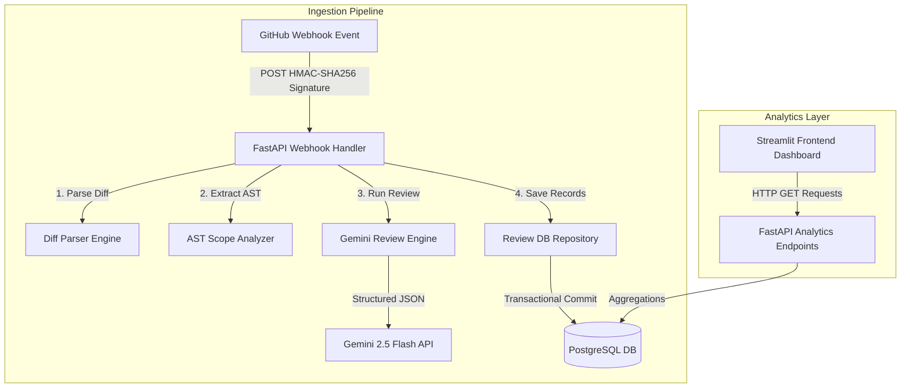
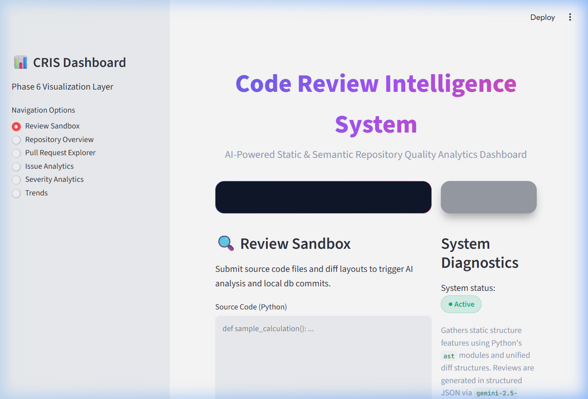
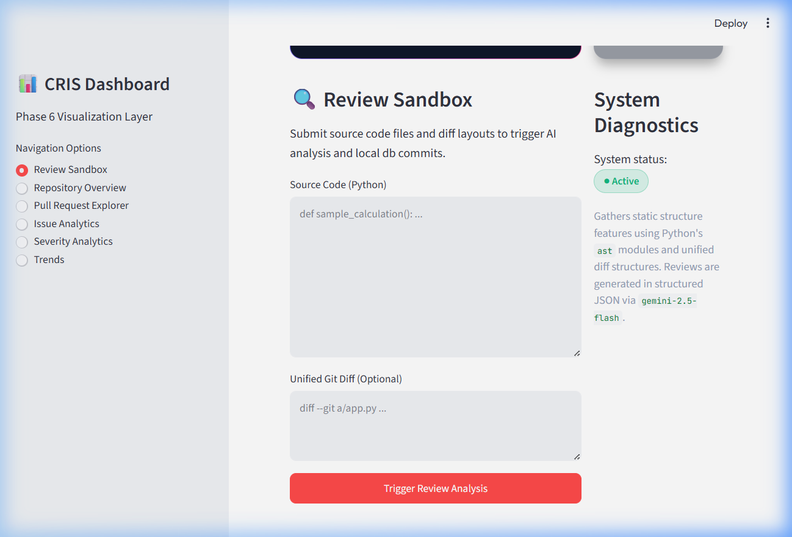
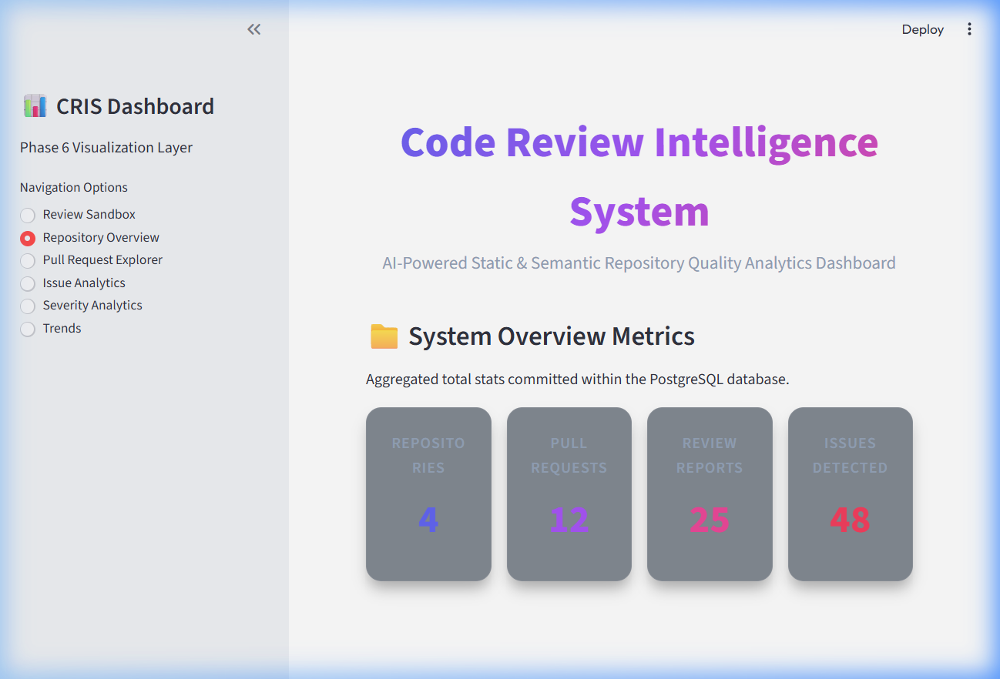
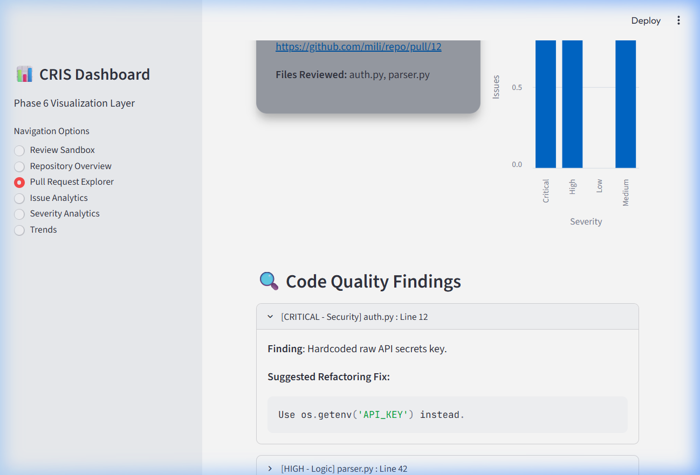
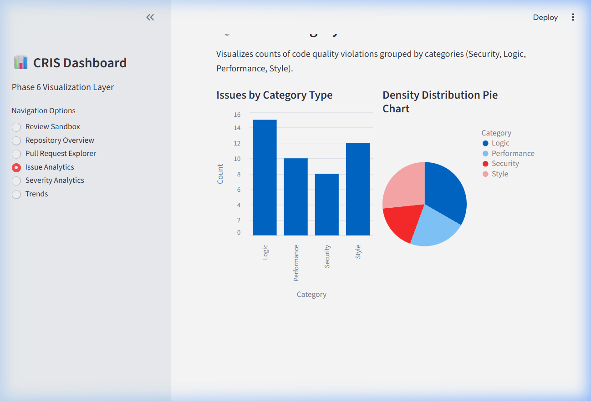
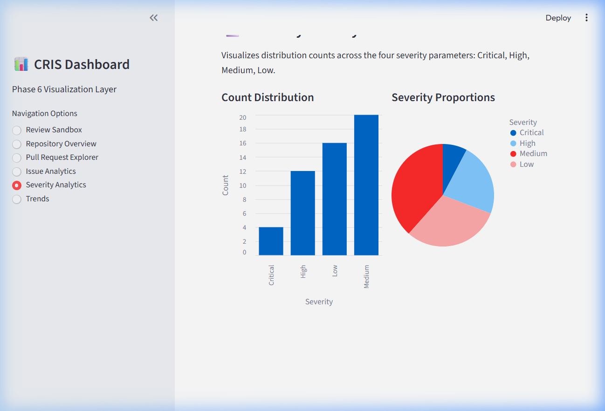
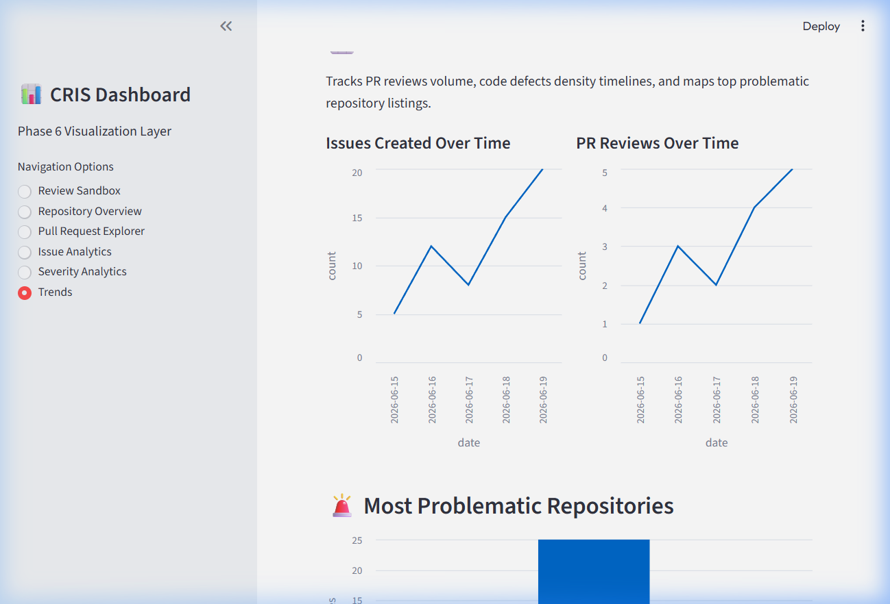

# 🔍 Code Review Intelligence System (CRIS)

[](https://www.python.org/)
[](https://fastapi.tiangolo.com/)
[](https://streamlit.io/)

CRIS (Code Review Intelligence System) is a developer-focused utility designed to automate static and semantic code reviews on pull requests. The system ingests GitHub webhooks, parses unified git diff outputs, constructs AST scopes to pinpoint changed classes or functions, maps local context, and queries the Gemini 2.5 Flash model using structured Pydantic response constraints. Findings are persisted in PostgreSQL and made queryable via REST APIs for visualization on a Streamlit web interface.

---

## 💡 Key Highlights

- **Decoupled Architecture**: Strict separation of concerns between backend REST API processors and frontend client visuals.
- **Context-Aware Mapping**: Scans Python syntax trees to align changed unified diff lines with surrounding code scopes (e.g. classes, functions, exception blocks).
- **Schema-Enforced Outputs**: Configures response boundaries via Pydantic templates and JSON media type constraints to guarantee structured AI results.
- **Data Persistence**: Stores repositories, pull request logs, file reports, and issues transactionally via PostgreSQL/SQLAlchemy.
- **Visual Analytics**: Interactive Streamlit view showing KPI metrics cards, selector drilldowns, issue category aggregations, and quality trends over time.

---

## ❓ Why CRIS?

### 1. Unified Diff Parsing
Reviewing entire source code files during updates is token-inefficient and lacks context focus. CRIS uses `unidiff` to isolate only the modified line ranges and hunk additions, limiting the review scope specifically to the updated code.

### 2. AST Context Extraction
Diff lines in isolation lack contextual logic (e.g. changing line 15 does not explain which function it is in or what variables are in scope). CRIS parses target files using Python's `ast` module, maps the changed line indices to class or function nodes, and extracts surrounding constructs (enclosing loops, conditional statements, and parameters) to reconstruct a complete semantic view of the change.

### 3. Structured Review Generation
Instead of returning unstructured text paragraphs, CRIS utilizes Pydantic validation schemas with the `google-genai` SDK (`response_mime_type="application/json"`) to query Gemini 2.5 Flash. The output is structured JSON that maps code critiques to specific files, line numbers, issue categories (Security, Logic, Performance, Style), and severity bounds (Critical, High, Medium, Low), compatible directly with SQL storage formats.

### 4. Comparison to Sending Raw Code to an LLM
| Feature | Direct LLM Code Sending | Code Review Intelligence System (CRIS) |
| :--- | :--- | :--- |
| **Token Efficiency** | High (sends whole files, duplicating unchanged sections) | Low (sends only changed diff hunks + extracted AST scopes) |
| **Parsing Reliability**| Low (susceptible to formatting variations or text explanations) | Guaranteed (enforced via Pydantic model response schemas) |
| **Contextual Scopes** | Assumes the model infers boundary hierarchies | Computes exact boundary indices using Python standard AST visitors |
| **Integrations** | Ad-hoc text outputs | Relational DB storage mapping repositories, PRs, and issues |

---

## 🛠️ System Architecture & Data Flow

CRIS runs the review steps on webhook ingestion and serves the aggregated findings over decoupled REST APIs.



For detailed sequence diagrams, relational schemas, and deployment instructions, refer to [architecture.md](docs/architecture.md).

---

## 📊 Visual Gallery (Screenshots)

Below are screenshot layouts from the Streamlit verification dashboard:

### 1. Review Sandbox Tab
*Lets developers submit Python code inputs and unified diff layouts to simulate webhook-based semantic checks.*



### 2. Repository Overview KPI Cards
*Displays overall repository metrics, reviewed pull request counts, and code issues detected.*


### 3. Pull Request Explorer & Findings
*Select target repositories and PR numbers to view analyzed file metrics and inspect specific refactoring suggestions.*


### 4. Issue and Severity Analytics
*Visualizes defect distributions grouped by category (Security, Logic, Performance, Style) and severity boundaries (Critical, High, Medium, Low) using interactive Altair charts.*



### 5. Historical Quality Trends
*Traces code review volume timelines and maps top problematic repository listings.*


---

## ⚙️ Environment Variables Configuration

Create a `.env` file in the root workspace folder matching the configuration variables:

| Variable | Required | Default | Description |
| :--- | :---: | :--- | :--- |
| `APP_ENV` | No | `development` | Environment mode (`development`, `production`, `testing`). |
| `SECRET_KEY` | No | `temporary-secret-key-for-development` | Key used for encrypting session keys. |
| `API_HOST` | No | `127.0.0.1` | Host interface for backend FastAPI startup. |
| `API_PORT` | No | `8000` | Port for backend FastAPI service. |
| `DB_HOST` | No | `127.0.0.1` | Hostname for the PostgreSQL database. |
| `DB_PORT` | No | `5432` | Port connection parameter for PostgreSQL. |
| `DB_USER` | No | `postgres` | Database admin username. |
| `DB_PASSWORD` | No | `postgres` | Database credentials password. |
| `DB_NAME` | No | `cris_db` | Name of the database schema target. |
| `GEMINI_API_KEY` | **Yes** | — | Google Gemini API credentials (from Google AI Studio). |
| `GEMINI_MODEL` | No | `gemini-2.5-flash` | Gemini model variant to utilize for code reviews. |
| `GITHUB_WEBHOOK_SECRET`| No | `temporary-dev-webhook-secret` | SHA-256 webhook digest verification secret. |
| `GITHUB_TOKEN` | **Yes** | — | GitHub Personal Access Token (PAT) to query code diffs. |

---

## 📂 Project Structure

```
CRIS-Code-Review-Intelligence-System/
├── .github/
│   └── workflows/
│       └── ci.yml             # Github Actions Continuous Integration setup
├── backend/
│   ├── app/
│   │   ├── api/
│   │   │   └── v1/
│   │   │       ├── endpoints/
│   │   │       │   ├── __init__.py
│   │   │       │   ├── analytics.py   # Aggregated analytics APIs
│   │   │       │   ├── health.py      # System health API
│   │   │       │   ├── reviews.py     # Sandbox review submissions endpoint
│   │   │       │   └── webhook.py     # GitHub webhook receiver endpoint
│   │   │       └── router.py          # Unified endpoint registration router
│   │   ├── core/
│   │   │   ├── __init__.py
│   │   │   ├── config.py              # Environment variables parser
│   │   │   ├── database.py            # SQLAlchemy session binds
│   │   │   └── security.py            # Webhook signature cryptographics
│   │   ├── models/
│   │   │   ├── __init__.py            # Model declarations registration
│   │   │   ├── base.py                # SQLAlchemy declarative base base class
│   │   │   ├── pull_request.py        # pull_requests table model
│   │   │   ├── repository.py          # repositories table model
│   │   │   ├── review_issue.py        # review_issues table model
│   │   │   └── review_report.py       # review_reports table model
│   │   ├── parsers/
│   │   │   ├── __init__.py
│   │   │   ├── ast_parser.py          # Python AST traversal and boundary analyzer
│   │   │   └── diff_parser.py         # unidiff parse helper wrapper
│   │   ├── schemas/
│   │   │   ├── __init__.py
│   │   │   ├── ast.py                 # AST metadata validation schemas
│   │   │   ├── diff.py                # Diff files validation schemas
│   │   │   ├── github.py              # GitHub webhook schema payloads
│   │   │   └── review.py              # Pydantic schemas for review outputs
│   │   ├── services/
│   │   │   ├── __init__.py
│   │   │   ├── context_builder.py     # Merges diff and AST scopes into a prompt
│   │   │   ├── diff_retrieval.py      # Fetches diff and code files from GitHub
│   │   │   ├── gemini_service.py      # Executes generative calls to Gemini Flash
│   │   │   └── review_repository.py   # Orchestrates database CRUD transactionally
│   │   └── main.py                    # App initializer setup
│   └── tests/                         # Pytest integration tests suites
├── docs/
│   ├── screenshots/                   # PNG visual files
│   ├── architecture.md                # System sequence and ERD charts
│   ├── development_log.md             # Chronological development logs
│   └── interview_preparation.md       # 10 deep technical Q&As
├── frontend/
│   └── app.py                         # Streamlit visual client app
├── .env.example
├── .gitignore
├── README.md                          # Repository documentation hub
└── requirements.txt
```

---

## 📡 Backend API Endpoints Documentation

FastAPI routes are grouped under the versioned prefix `/api/v1`:

### 1. Webhook Receivers
- `POST /api/v1/webhook/github`
  - Ingests pull request notifications from GitHub.
  - Verifies payload integrity using HMAC-SHA256 signature from `X-Hub-Signature-256`.

### 2. Sandbox Reviews
- `POST /api/v1/reviews/review`
  - Accepts raw code strings and optional diff structures to execute localized reviews on the fly.

### 3. Analytics Services
- `GET /api/v1/analytics/overview` - Fetches KPI metric totals.
- `GET /api/v1/analytics/repositories` - Returns list of tracked code repositories.
- `GET /api/v1/analytics/repositories/{repo_id}/pulls` - Lists PR histories under a specific repo.
- `GET /api/v1/analytics/pulls/{pr_id}` - Returns review files, severity ratios, and issues list for a pull request.
- `GET /api/v1/analytics/issues` - Returns categories totals (Security, Logic, Performance, Style).
- `GET /api/v1/analytics/severities` - Returns severity distributions (Critical, High, Medium, Low).
- `GET /api/v1/analytics/trends` - Date-grouped issue/review counts timeline and top problematic repositories.

---

## 🚀 Local Development Setup & Execution

### 1. Setup Environment
```bash
# Clone the repository
git clone https://github.com/milimathew2005/CRIS-Code-Review-Intelligence-System.git
cd CRIS-Code-Review-Intelligence-System

# Initialize and activate virtual environment
python -m venv .venv
source .venv/bin/activate  # On Windows: .venv\Scripts\Activate.ps1

# Install requirements
pip install -r requirements.txt
```

### 2. Run Tests
Verify configuration logic and initialize the testing suite database:
```bash
pytest backend/tests/
```

### 3. Execution
Start backend API server (FastAPI):
```bash
python -m uvicorn backend.app.main:app --port 8000 --reload
```
Start frontend dashboard client (Streamlit):
```bash
streamlit run frontend/app.py --server.port 8501
```
View the dashboard at [http://localhost:8501](http://localhost:8501).
