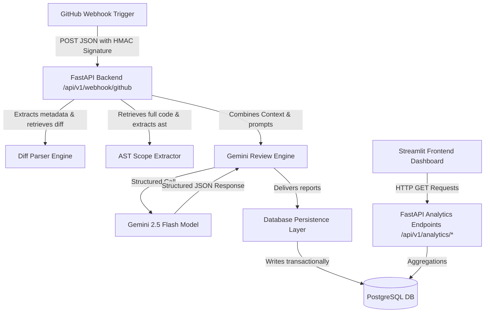
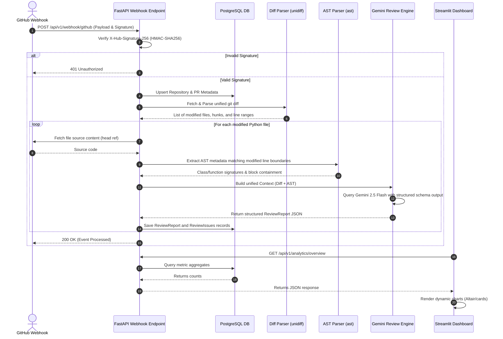
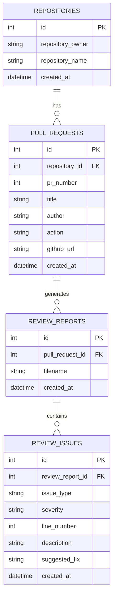

# CRIS Architecture & Database Layout

This document describes the architectural layout, database models, detailed data sequence flow, and deployment instructions for the Code Review Intelligence System (CRIS).

---

## 1. Architectural Layout

The system is designed with a decoupled architecture to isolate components and ensure backend stability independent of the visualization layer:



---

## 2. System Flow Sequence Diagram

The sequence diagram below traces the end-to-end lifecycle of a webhook ingestion through parsing, model evaluation, persistence, and client consumption:



---

## 3. Database ER Diagram

CRIS persists reviews and findings using PostgreSQL. Below is the Entity Relationship Diagram (ERD) defining the schema, constraints, and relationships:



### Table Schema Details & Rules
1. **`repositories`**:
   - Represents a tracked repository.
   - Cascade delete: Deleting a repository deletes all associated pull requests.
2. **`pull_requests`**:
   - Represents a specific pull request event.
   - Unique constraint: `uq_repo_pr_number` on `(repository_id, pr_number)` ensures unique PR indexing per repository.
3. **`review_reports`**:
   - Stores reviewed files details per PR. One record per file.
4. **`review_issues`**:
   - Holds structured AI code findings.
   - Enforces specific validation parameters:
     - `issue_type`: Allowed values include `Security`, `Logic`, `Performance`, `Style`.
     - `severity`: Allowed values include `Critical`, `High`, `Medium`, `Low`.

---

## 4. Deployment Guide

### A. Production Database Setup (Migrations via Alembic)
For production systems, schema migrations should be managed via Alembic to prevent data loss.

1. **Initialize Alembic**:
   ```bash
   alembic init alembic
   ```
2. **Configure Environment**:
   Update `alembic/env.py` to import models:
   ```python
   from backend.app.models.base import Base
   target_metadata = Base.metadata
   ```
3. **Generate & Run Migrations**:
   ```bash
   # Generate migration script
   alembic revision --autogenerate -m "Add CRIS initial schema"
   
   # Apply migration to PostgreSQL
   alembic upgrade head
   ```

---

## 5. Dockerized Container Setup

To deploy CRIS using Docker containers (PostgreSQL database, FastAPI backend, and Streamlit frontend), use the configuration below.

### 1. [NEW] Dockerfile (Backend)
Create `backend.Dockerfile` in the root:
```dockerfile
FROM python:3.11-slim

WORKDIR /app

RUN apt-get update && apt-get install -y --no-install-recommends \
    build-essential \
    libpq-dev \
    && rm -rf /var/lib/apt/lists/*

COPY requirements.txt .
RUN pip install --no-cache-dir -r requirements.txt

COPY backend/ /app/backend/
ENV PYTHONPATH=/app

EXPOSE 8000
CMD ["uvicorn", "backend.app.main:app", "--host", "0.0.0.0", "--port", "8000"]
```

### 2. [NEW] Dockerfile (Frontend)
Create `frontend.Dockerfile` in the root:
```dockerfile
FROM python:3.11-slim

WORKDIR /app

COPY requirements.txt .
RUN pip install --no-cache-dir -r requirements.txt

COPY frontend/ /app/frontend/

EXPOSE 8501
CMD ["streamlit", "run", "frontend/app.py", "--server.port", "8501", "--server.address", "0.0.0.0"]
```

### 3. [NEW] docker-compose.yml
Create `docker-compose.yml` in the root:
```yaml
version: '3.8'

services:
  db:
    image: postgres:15-alpine
    container_name: cris_postgres_db
    environment:
      POSTGRES_DB: ${DB_NAME:-cris_db}
      POSTGRES_USER: ${DB_USER:-postgres}
      POSTGRES_PASSWORD: ${DB_PASSWORD:-postgres}
    ports:
      - "5432:5432"
    volumes:
      - postgres_data:/var/lib/postgresql/data
    healthcheck:
      test: ["CMD-SHELL", "pg_isready -U ${DB_USER:-postgres} -d ${DB_NAME:-cris_db}"]
      interval: 5s
      timeout: 5s
      retries: 5

  backend:
    build:
      context: .
      dockerfile: backend.Dockerfile
    container_name: cris_fastapi_backend
    ports:
      - "8000:8000"
    environment:
      - GEMINI_API_KEY=${GEMINI_API_KEY}
      - GITHUB_TOKEN=${GITHUB_TOKEN}
      - GITHUB_WEBHOOK_SECRET=${GITHUB_WEBHOOK_SECRET}
      - DB_USER=${DB_USER:-postgres}
      - DB_PASSWORD=${DB_PASSWORD:-postgres}
      - DB_HOST=db
      - DB_PORT=5432
      - DB_NAME=${DB_NAME:-cris_db}
    depends_on:
      db:
        condition: service_healthy

  frontend:
    build:
      context: .
      dockerfile: frontend.Dockerfile
    container_name: cris_streamlit_frontend
    ports:
      - "8501:8501"
    environment:
      - BACKEND_API_URL=http://backend:8000/api/v1
    depends_on:
      - backend

volumes:
  postgres_data:
```

Launch the entire stack with:
```bash
docker-compose up --build
```
